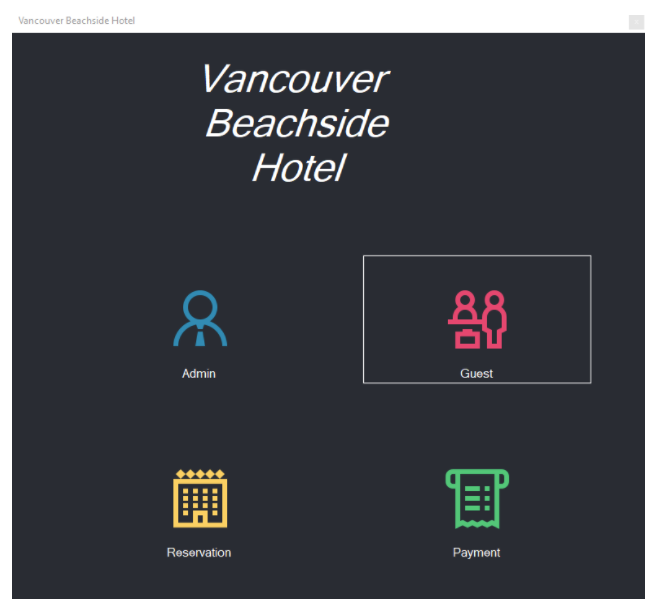
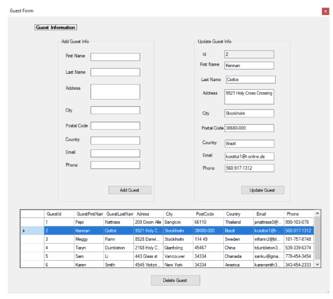
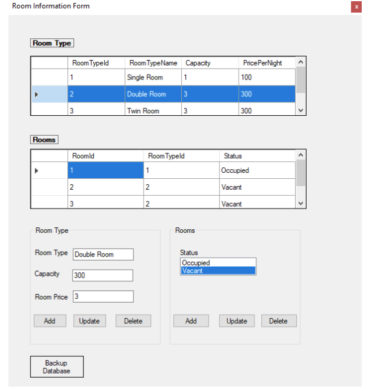
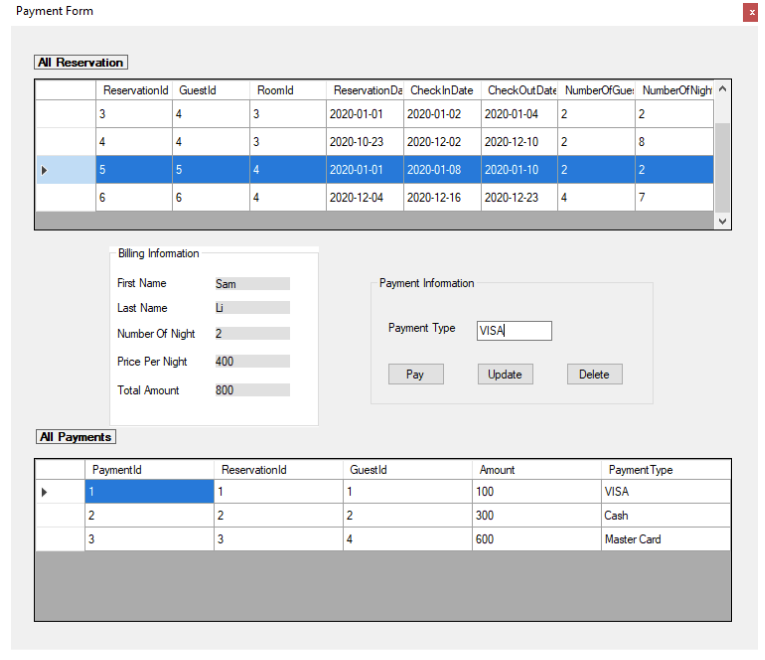

## 	Project Description
There is a 5-Star hotel in Vancouver with 100 Rooms and one presidential Suite; the largest in the state. They don’t want to have paper records because they are difficult to manage and backtrack too. Hence, they need software to manage the bookings in the hotel at the front desk. The working model of the software that satisfies client requirements is the deliverable of the project.

The scope of the project aims to have an admin who is basically the hotel manager who manages information of the rooms and services provided. Admin will also keep a backup of all the files in the database. The front desk agent add/update/cancel the bookings for the customer. Also, it does all the billing as well. 

Requirements of the project include:
Hardware: 1.8 GHz or faster processor, 2GB of RAM or higher, HDD minimum 800MB Operating System: Windows XP or higher
Software: Visual Studio 2019 (latest version) with SQL Server Express

Process Model
There are two main actors Admin (Hotel Manager) and Front Desk Agent. The admin access the backup add room, delete room, cancel bookings and view the bills and room statuses.
The Front desk agent can add the guests, update preferences, create the bills and view the status for rooms and bookings.

## Database model

## User interface

Four Windows Forms  
Main Form 
Guest Form ( Front desk user can CRUD guest )
Admin Form ( Admin user can CRUD room type and room )
Reservation Form ( Front desk user can CRUD reservation )
 Payment Form ( Admin user can CRUD payment )

Main Page is to give users access to the Guest form, Admin form, Reservation Form, and Payment form. If the user is admin then the user clicks the admin it will go to the room information form. option Room Info. when the user clicks the room info option. The room info window form will pop up and give options to add Room info such as room type, status, price per night. Admin can add the room, update the room info and delete the room info. 
The second option for the admin is the payment option.  It contains the reservation and payment tables, billing information, pays, updates, and delete payment functions 
 The guest form is for the front desk user. When the front desk user clicks the front desk tab the customer option will show another customer info window form. On this page, the front desk user can add the customer information to our database and the data will show up in the data grid view. Front desk users have options to add customers, delete customers and update the customer information. 
The reservation form is where the front desk user can make a reservation. Based on the guest information and room information. Front desk users can select the guest and room from the list box and put how many people will stay, give options to select the dates. Front desk users can book the room, update the room and cancel the room. 
There is a backup button in the admin form. For the database to store XML when the user clicks the admin button it will give the option to click the store database page and when the user clicks the button the database will store in the XML file.

## Functions and Navigations

### 1. Initial Page
The initial page contains four child forms (Admin, Guest, Reservation, Payment)

Click the buttons to access the child forms

### 2. Guest Form
The guest contains the guest table, add, update, and delete guest functions

Fill up the text boxes, and click ‘Add’ to add a guest to the table
Select a row from the DataGridView, and click ‘Update’/’Delete’ to update and delete the guest information 

### 3. Admin Form
Admin form contains Room Type and Room tables, add, update, delete functions for both Room Type and Room, and button for backup the database

Room Type
Fill up the text boxes, and click ‘Add’ to add a room type
Select a row from  the Room Type table and click ‘Update’/’Delete’ to update and delete the room type
Room
 Select a row from the Room Type table, and choose a status, and click Add  to Add a room 
Select a row from the Room table, and click Update/Delete  to update and delete a row from the room 
  	     Backup Database
Click the Backup Database button to back up the DB to XML file

### 4. Reservation Form
Reservation form contains reservation table, Guest ListBox, Room ListBox, add, update, and delete reservation functions 
Choose a guest and a room from list boxes and fill up the required information to book a room
Select a row from the reservation table to update, and delete a reservation

### 5. Payment Form
Payment form contains the Reservation and Payment tables, billing information, pay,      update, and delete payment functions

Select a row from the Reservation table to show the billing information and fill up the payment type inorder to make the payment
Select a row from the Payment table to update, and delete the payment

## Future Work

Booking Status Validation
Validate the room availability when the user tries to make a room reservation. Need to keep track of which room is occupied on which date to validate the booking.  
Improve User Interface 
	Make child forms simpler to make them user-friendly. 

